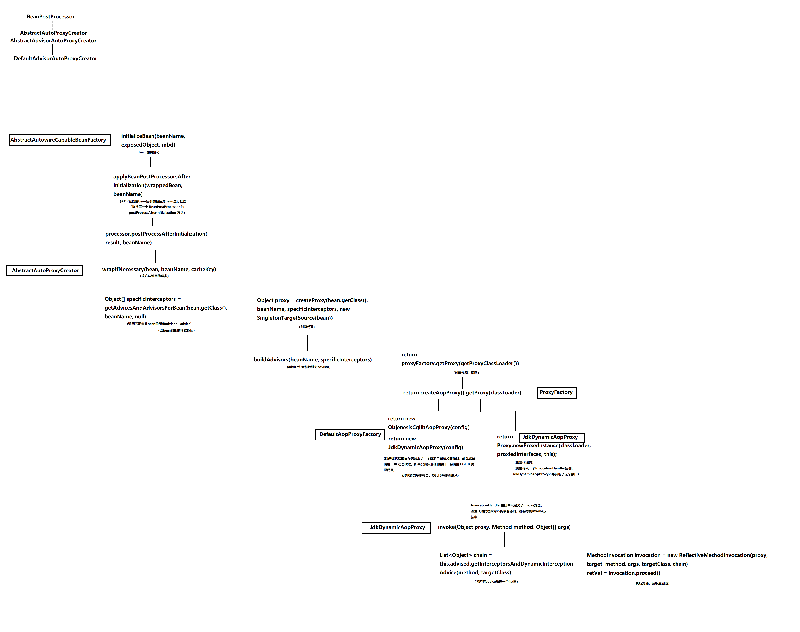

# Spring源码简单解析

环境：

- JDK：1.8
- IDE：IDEA 2020.1

- Spring Framework：5.2.10.RELEASE
- aspectjweaver：1.9.5
- junit：4.13


## Spring概述

Spring的含义：

- 广义：是基于Spring Framework的一系列框架，如Spring Data、Spring Boot、Spring Cloud等

  > 可以上Spring官网看一看：https://spring.io/

- 狭义：Spring Framework

通常我们在讨论时所提到的Spring都指的是Spring Framework


Spring的核心是控制反转和面向切面。

- 控制反转（Inverse of Control, IOC）：

  通过控制反转，对象在被创建的时候，由一个调控系统内所有对象的外界实体将其所依赖的对象的引用传递给它。

- 面向切面（Aspect Oriented Programming, AOP）：

  通过运行期动态代理实现在不修改源代码的情况下给程序动态统一添加功能的一种技术。


## IOC解析

IOC中需要把bean交给容器进行处理。

名词解释：

- Bean：在计算机英语中，有可重用组件的含义

- JavaBean：用java语言编写的可重用组件，如实体类


### IOC的使用

此处介绍IOC的基本使用

#### 基于xml

```java
// 实体类User，在本例子中作为bean类
public class User {
    private String name;
    private int age;
    // 此处省略setter、getter和toString方法
}
```

```xml
<!-- 用于设定bean信息的xml文件，需要指定bean的信息，以便spring从中读取 -->
<beans xmlns="http://www.springframework.org/schema/beans"
       xmlns:xsi="http://www.w3.org/2001/XMLSchema-instance"
       xsi:schemaLocation="http://www.springframework.org/schema/beans
        http://www.springframework.org/schema/beans/spring-beans.xsd">

    <!-- id是这个bean在容器中的标识符，class需要指定这个类的全限定类名 -->
    <bean id="user" class="com.example.ioc.User"></bean>

</beans>
```

```java
// bean的使用
public class IOCTest {
    public static void main(String[] args) {
        // 获取IOC容器，需要传入对应的xml配置文件
        ApplicationContext context = new ClassPathXmlApplicationContext("classpath:ioc/ioc-config.xml");
        // 根据bean的id来获取bean
        User user = (User) context.getBean("user");
        // 调用方法
        user.setName("Tom");
        user.setAge(10);
        System.out.println(user.toString());
    }
}
```

#### 基于注解

```java
@Component
public class User {
    private String name;
    private int age;
    // 省略setter、getter、toString方法
}
```

```java
@RunWith(SpringJUnit4ClassRunner.class)
@ContextConfiguration(classes = IOCAnnoTest.class)
@Configuration
@ComponentScan("com.example.iocAnno")
public class IOCAnnoTest {
    @Autowired
    private User user;

    @Test
    public void testIoc(){
        user.setName("Tom");
        System.out.println(user.getName());
    }
}
```


### IOC源码


## AOP解析

AOP主要与GoF设计模式中的代理模式联系较为紧密，在Spring中是基于IOC容器来实现的，只需要在调用getBean方法时返回代理类实例即可。这个代理类并不需要自己写代码，Spring采用 JDK Proxy 或 CGLIB 动态生成。

AOP可以在不修改源代码的情况下给程序添加功能。简单来说就是在不修改某个类源代码的情况下，要在它的某些方法之前或之后添加一些功能（代码），而且对于调用者来说尽量隐形。（此处如果理解设计模式中的代理模式后应该能明白）

AOP需要拦截这些方法，并在它的基础上添加功能。


名词解释：

- Joinpoint：连接点。指程序执行的某个特定位置（如某个方法调用前、调用后、方法抛出后）。一个类或一段代码拥有一些具有边界性值的特定点，这些称为连接点。Spring仅支持方法的连接点。
- Pointcut：切入点。用于匹配需要进行处理的连接点，可以形象地理解为连接点的查询条件。
- Weaving：织入。将添加功能的程序添加到目标连接点上的过程。
  - 编译期织入
  - 装载期织入
  - 运行时织入：Spring采用了动态代理的方式实现了运行时织入
- Advice：通知/增强。织入到目标连接点上的一段程序代码。
  - 前置通知
  - 后置通知
  - 异常通知
  - 最终通知
  - 环绕通知
- Proxy：代理。当一个类被织入增强后，就产生一个结果代理类。
- Aspect：切面。切入点和通知的结合。


### AOP使用

此处介绍AOP的简单使用

#### 基于xml

```java
// 实体类
public class User {
    private String name;
    private int age;
    // 此处省略setter、getter和toString方法
}
```

```java
// 业务层接口
public interface UserService {
    User createUser(String name, int age);
    User queryUser();
}
```

```java
// 业务层实现类
public class UserServiceImpl implements UserService{
    private static User user = null;
    @Override
    public User createUser(String name, int age) {
        user = new User();
        user.setName(name);
        user.setAge(age);
        System.out.println("执行createUser");
        return user;
    }

    @Override
    public User queryUser() {
        System.out.println("执行queryUser");
        return user;
    }
}
```

```java
// 前置通知
public class LogBeforeAdvice implements MethodBeforeAdvice {
    @Override
    public void before(Method method, Object[] objects, Object o) throws Throwable {
        System.out.println("准备执行方法：" + method.getName() + ",参数列表：" + Arrays.toString(objects));
    }
}
```

```java
// 后置通知
public class LogAfterAdvice implements AfterReturningAdvice {
    @Override
    public void afterReturning(Object o, Method method, Object[] objects, Object o1) throws Throwable {
        System.out.println("方法返回：" + o);
    }
}
```

```xml
<!-- aop相关的xml配置文件 -->
<beans xmlns="http://www.springframework.org/schema/beans"
       xmlns:xsi="http://www.w3.org/2001/XMLSchema-instance"
       xsi:schemaLocation="http://www.springframework.org/schema/beans
        http://www.springframework.org/schema/beans/spring-beans.xsd">

    <!-- 需要进行aop的类 -->
    <bean id="userServiceImpl" class="com.example.aop.UserServiceImpl"></bean>

    <!-- adivce们 -->
    <bean id="logBeforeAdvice" class="com.example.aop.LogBeforeAdvice"></bean>
    <bean id="logAfterAdvice" class="com.example.aop.LogAfterAdvice"></bean>

    <!-- 配置切面 -->
    <bean id="logBeforeAdvisor" class="org.springframework.aop.support.RegexpMethodPointcutAdvisor">
        <property name="advice" ref="logBeforeAdvice"></property>
        <property name="pattern" value="com.example.aop.*.create.*"></property>
    </bean>
    <bean id="logAfterAdvisor" class="org.springframework.aop.support.RegexpMethodPointcutAdvisor">
        <property name="advice" ref="logAfterAdvice"></property>
        <property name="pattern" value="com.example.aop.*.query.*"></property>
    </bean>

    <!-- 放入一个DefaultAdvisorAutoProxyCreator，可以让ioc容器中所有的advisor来匹配方法 -->
    <bean class="org.springframework.aop.framework.autoproxy.DefaultAdvisorAutoProxyCreator"></bean>

</beans>
```

```java
// 调用测试
public class AOPTest {
    public static void main(String[] args) {
        // 启动IOC容器
        ApplicationContext context = new ClassPathXmlApplicationContext("classpath:aop/aop-config.xml");
        // 获取AOP代理的bean
        UserService userService = context.getBean(UserService.class);

        userService.createUser("Tom", 10);
        userService.queryUser();
    }
}
```


#### 基于注解

```java
@Component("user")
public class User {
    private String name;
    private int age;
	// 此处省略setter、getter和toString方法
}
```

```java
@Service("userService")
public class UserServiceImpl implements UserService {
    @Autowired
    private User user;
    @Override
    public User createUser(String name, int age) {
        user.setName(name);
        user.setAge(age);
        System.out.println("执行createUser");
        return user;
    }

    @Override
    public User queryUser() {
        System.out.println("执行queryUser");
        return user;
    }
}

```

```java
@Component("logger")
@Aspect
public class Logger {
    /**
     * 设置切入点
     */
    @Pointcut("execution(* com.example.aopAnno.UserServiceImpl.*(..))")
    private void pt1(){}

    /**
     * 前置通知
     */
    @Before("pt1()")
    public void beforePrintLog(){
        System.out.println("beforePrintLog记录");
    }

    /**
     * 后置通知
     */
    @After("pt1()")
    public void afterPrintLog(){
        System.out.println("afterPrintLog记录");
    }
}

```

```java
@RunWith(SpringJUnit4ClassRunner.class)
@ContextConfiguration(classes = AOPAnnoTest.class)
@Configuration
@ComponentScan("com.example.aopAnno")
@EnableAspectJAutoProxy
public class AOPAnnoTest {
    @Autowired
    private UserService userService;

    @Test
    public void testAop(){
        userService.createUser("Tom", 10);
        System.out.println(userService.queryUser());
    }
}
```


### AOP源码




整理自：

- [Spring IOC 容器源码分析](https://javadoop.com/post/spring-ioc)
- [Spring AOP 源码解析](https://javadoop.com/post/spring-aop-source)
- [Spring AOP 使用介绍，从前世到今生](https://javadoop.com/post/spring-aop-intro)
- [AOP中的连接点（Joinpoint）、切点（Pointcut）、增强（Advice）、引介（Introduction）、织入（Weaving）、切面（Aspect）](https://blog.csdn.net/qq_43460335/article/details/108087188)

致敬！

