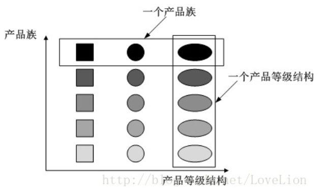

# 设计模式

此处只包含部分设计模式的介绍，更多请翻阅相关的书籍。

参考书籍：

- 《Java设计模式》（刘伟）


## 设计原则

单一职责原则：一个类只负责一个功能领域中的相关职责。

开闭原则：对扩展开放，对修改封闭。

里氏代换原则：所有引用基类（父类）的地方能透明地使用其子类的对象。

依赖倒转原则：针对接口编程，而不是针对实现编程。

接口隔离原则：使用多个专门的接口，而不使用单一的总接口，客户端不应该依赖那些它不需要的接口。类似于单一职责原则。

合成复用原则：尽量使用对象组合，而不是继承来达到复用的目的。

迪米特法则：尽可能少地与其他实体发生直接的相互作用。


## 部分设计模式介绍

### 抽象工厂模式

提供一个创建一系列相关或相互依赖对象的接口，而无需指定他们具体的类。




在抽象工厂模式中，增加产品族很好地符合了开闭原则，但如果要增加新的产品等级结构，由于工厂中不存在该方法，因此会违背开闭原则。它要求设计人员在一开始就要设定好需要的产品等级结构。

使用场景：

1. 系统不依赖于产品类实例如何被创建、组合和表达。
2. 系统中有多于一个的产品族，属于一个产品族的产品将在一起使用
3. 产品等级结构稳定，设计完成后，不会向系统中增加新的产品等级结构或者删除已有的产品等级结构。


### 单例模式

单例模式（Singleton Pattern）的好处：部分实例只需要一份，并不需要多个实例，多个实例可能会浪费资源；需要唯一一个实例来保持数据的一致性。在单例模式中，类只有一个实例，且该实例由该类自己创建。

如何实现单例模式：

1. 将构造函数设置为私有
2. 定义一个该类的私有静态成员变量
3. 定义一个公有静态方法，如果2中的变量为null，则创建新对象，否则直接返回对象

```java
// 简单的单例模式：
class TaskManager{
    private static TaskManager tm = null;
    private TaskManager(){......}
    public static TaskManager getInstance(){
        if(tm == null){
            tm = new TaskManager();
        }
        return tm;
    }
    public void displayProcesses(){......}
    public void displayServices(){......}
}
```

单例模式分为两种，分别是饿汉式（立即加载）和懒汉式（懒加载/延迟加载）

#### 饿汉式单例类

定义静态变量时实例化单例类，因此在类加载时就已经创建了单例对象

```java
class EagerSingleton{
    // 注意final修饰
    private static final EagerSingleton instance = new EagerSingleton();
    private EagerSingleton(){......}
    public static EagerSington getInstance(){
        return instance;
    }
}
```

使用饿汉式单例类来实现负载均衡器LoadBalancer类的设计，就不会出现创建多个单例对象的情况，确保单例对象的唯一性。

#### 懒汉式单例类

在懒汉式单例类中，当第一次调用 getInstance() 方法时才会实例化，在类加载时并不自行实例化，这种技术称为延迟加载（Lazy Load）技术，即需要时再加载。

为了避免多个线程同时调用 getInstance() 方法，可以使用线程锁定synchronized：

```java
class LazySingleton{
    private static LazySingleton instance = null;
    private LazySingleton(){......}
    synchronized public static LazySingleton getInstance(){
        if(instance == null){
            instance = new LazySingleton();
        }
        return instance;
    }
}
```

该方法使用线程锁的方式解决了线程安全问题，但是由于每次调用 getInstance() 方法时都需要进行县城锁定判断，在多线程高并发的访问环境中会导致性能的大大降低。

为了降低线程锁带来的影响，使用双重检查锁定来进行修改：

```java
class LazySingleton{
    // volatile:用来确保将变量的更新操作通知到其他线程。当把变量声明为volatile类型后，编译器与运行时都会注意到这个变量是共享的，因此不会将该变量上的操作与其他内存操作一起重排序。
    //当对非 volatile 变量进行读写的时候，每个线程先从内存拷贝变量到CPU缓存中。如果计算机有多个CPU，每个线程可能在不同的CPU上被处理，这意味着每个线程可以拷贝到不同的 CPU cache 中。而声明变量是 volatile 的，JVM 保证了每次读变量都从内存中读，跳过 CPU cache 这一步。
    //volatile关键字会屏蔽Java虚拟机所作的一些代码优化，可能导致系统运行效率降低
    private volatile static LazySingleton instance = null;
    private LazySingleton(){......}
    public static LazySingleton getInstance(){
        if(instance == null){
            synchronized(LazySingleton.class){
                // 第二重判断，保证instance是null
                if(instance == null){
                    instance = new LazySingleton();
                }
            }
        }
        return instance;
    }
}
```


饿汉式单例类与懒汉式单例类的优劣对比：

1. 饿汉式单例类的调用速度会更快，但是由于无论需不需要都会创建单例对象，会占用更多的资源，以及在系统加载时耗时会更长。
2. 懒汉式单例类由于在第一次使用才会创建，因此不会一直占用资源，但实例初始化时会消耗大量时间。


### 原型模式

原型模式（Prototype Pattern）：通过一个原型对象克隆出多个一模一样的对象。

在原型模式中，通常包括以下几个部分：

1. Prototype：抽象原型类。可以是抽象类也可以是接口也可以是具体实现类，是所有具体原型的父类。
2. ConcretePrototype：具体原型类。其包含一个克隆方法，返回自己的一个克隆对象。
3. Client：客户类。首先直接实例化或者通过工厂模式创建一个原型对象，再调用原型对象中的克隆方法获得多个相同的对象。

在java的Object类中提供了clone方法（注意该克隆方法是**浅克隆**！），使用这种方式来进行克隆时相当于将Object类当成了抽象原型类。使用这种方式来实现克隆的步骤如下：

1. 在具体原型类中覆盖Object类中的 clone() 方法，并声明为public
2. 在clone方法中，调用super.clone()
3. 在具体原型类中实现Cloneable接口（若不实现该接口，则会报CloneNotSupportedException）

在java中如果需要实现**深克隆**，可以通过序列化等方式来实现。

> 序列化（Serialization）：将对象写到流的过程，写到流中的对象是原有对象的一个拷贝，而源对象仍然存在于内存中。该方式可以复制源对象引用的成员对象。若要使用序列化，需要实现Serialization接口（包括源对象和源对象的引用成员类）。


### 代理模式

代理模式（Proxy Pattern）：给某一个对象提供一个代理或占位符，并由代理对象来控制对原对象的访问。当无法直接访问某个对象或访问某个对象存在困难时，可以通过代理对象来间接访问，代理模式是最常用的结构型设计模式之一。为了保证客户端使用的透明性，所访问的真实对象与代理对象需要实现相同的接口。


代理模式中主要包含以下角色：

1. Subject：抽象主题角色。声明了真实主题和代理主题的公共接口。
2. Proxy：代理主题角色。包含对真实主题的引用，且提供一个与真是主题角色相同的接口。可以控制对真实主题的使用，负责在需要的时候创建和删除真实主题对象。通常在调用真实主题操作之前或之后还需要执行其他操作。
3. RealSubject：真实主题角色。